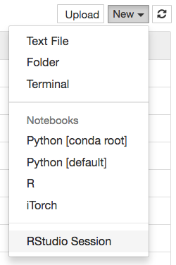

# nbrsessionproxy

**nbrsessionproxy** provides Jupyter server and notebook extensions to proxy an RStudio rsession.



If you have a JupyterHub deployment, nbrsessionproxy is useful to take advantage of JupyterHub's existing authenticator and spawner to launch RStudio in users' Jupyter environments. You can also run this from within Jupyter. Requires [nbserverproxy](https://github.com/jupyterhub/nbserverproxy).

Note that [RStudio Server Pro](https://www.rstudio.com/products/rstudio-server-pro/architecture) has more featureful authentication and spawning than the standard version, in the event that you do not want to use Jupyter's.

## Installation

Install the library:
```
pip install git+https://github.com/jupyterhub/nbrsessionproxy
```

Install the extensions for the user:
```
jupyter serverextension enable  --py nbrsessionproxy
jupyter nbextension     install --py nbrsessionproxy
jupyter nbextension     enable  --py nbrsessionproxy
```

Install the extensions for all users on the system:
```
jupyter serverextension enable  --py --sys-prefix nbrsessionproxy
jupyter nbextension     install --py --sys-prefix nbrsessionproxy
jupyter nbextension     enable  --py --sys-prefix nbrsessionproxy
```
